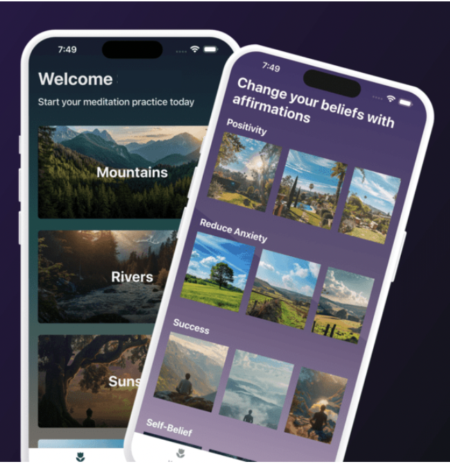
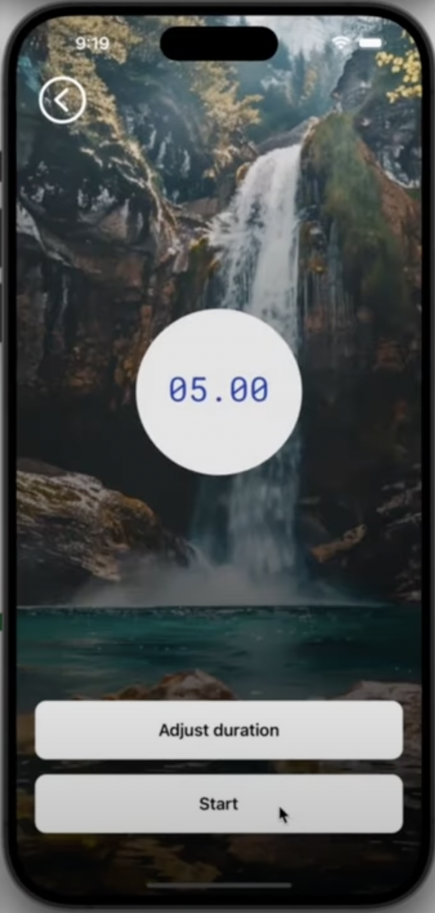

<div align="center">

  <div>
    
    
    
  </div>

  <h3 align="center">Meditation and Affirmations App - Mobile. iOS & Android</h3>

  
  
</div>
</div>
</div>

## 📋 <a name="table">Table of Contents</a>

1. 🤖 [Introduction](#introduction)
2. ⚙️ [Tech Stack](#tech-stack)
3. 🔋 [Features](#features)
4. 🤸 [Quick Start](#quick-start)

## <a name="introduction">🤖 Introduction</a>

Built with React Native + Typescript to deliver seamless user experiences, this app features a clean design utilizing FlatLists, Linear Gradients, modals, tab bars, icons, and file-based routing with Expo Router.

## <a name="tech-stack">⚙️ Tech Stack</a>

-   React Native
-   Expo
-   NativeWind
-   JavaScript
-   TypeScript

## <a name="features">🔋 Features</a>

👉 **Onboarding Screen**: Welcome screen with a linear gradient to help users get started with the app.

👉 **Meditation List Screen with Flat List**: A flat list displays previews of various meditations with corresponding images.

👉 **Audio Playing Capability**: Control audio playback and manage a meditation countdown timer.

👉 **Tab Navigation**: Navigate between sections like the Meditation Screen and Affirmations screen with ease using tab navigation.

👉 **Responsiveness**: Smooth performance and adaptability across various devices and screen sizes for a consistent user experience.

and many more, including code architecture and reusability

## <a name="quick-start">🤸 Quick Start</a>

Follow these steps to set up the project locally on your machine.

**Prerequisites**

Make sure you have the following installed on your machine:

-   [Git](https://git-scm.com/)
-   [Node.js](https://nodejs.org/en)
-   [npm](https://www.npmjs.com/) (Node Package Manager)

**Clone the Repository**

**Installation**

Install the project dependencies using npm:

```bash
npm install
```

**Running the Project**

```bash
npx expo start
```

**Expo Go**

Download the [Expo Go](https://expo.dev/go) app onto your device, then use it to scan the QR code from Terminal and run.

**iOS Simulator**

[iOS Simulator documentation](https://docs.expo.dev/workflow/ios-simulator/) : to install and run your application on an iOS Simulator for local development.

**Android Emulator**

[Android Studio documentation](https://docs.expo.dev/workflow/android-studio-emulator/) : to install and run your application on an Android Emulator for local development.

## <a name="snippets">🕸️ Snippets</a>

<details>
<summary><code>tailwind.config.js</code></summary>

```javascript
/** @type {import('tailwindcss').Config} */
module.exports = {
    content: [
        "./App.{js,jsx,ts,tsx}",
        "./app/**/*.{js,jsx,ts,tsx}", // Include all JS, JSX, TS, and TSX files in the app folder
        "./components/**/*.{js,jsx,ts,tsx}", // Include all JS, JSX, TS, and TSX files in the components folder]
        "./app/(tabs)/meditate.tsx",
    ],
    theme: {
        extend: {
            fontFamily: {
                rmono: ["Roboto-Mono", "sans-serif"],
            },
        },
    },
    plugins: [],
};
```

</details>

<details>
<summary><code>TypeScript file for Meditation data</code></summary>

```javascript
export interface MeditationType {
    id: number;
    title: string;
    image: string;
    audio: string;
}

export const MEDITATION_DATA: MeditationType[] = [
    {
        id: 1,
        title: "Mountains",
        image: "trees.webp",
        audio: "trees.mp3",
    },
    {
        id: 2,
        title: "Rivers",
        image: "river.webp",
        audio: "river.mp3",
    },
    {
        id: 3,
        title: "Sunset",
        image: "meditate-under-tree.webp",
        audio: "meditate-under-tree.mp3",
    },
    {
        id: 4,
        title: "Beaches",
        image: "beach.webp",
        audio: "beach.mp3",
    },
    {
        id: 5,
        title: "Starry Night",
        image: "yosemite-stars.webp",
        audio: "yosemite-stars.mp3",
    },
    {
        id: 6,
        title: "Waterfall",
        image: "waterfall.webp",
        audio: "waterfall.mp3",
    },
];

export const AUDIO_FILES: { [key: string]: any } = {
    "trees.mp3": require("@/assets/audio/trees.mp3"),
    "river.mp3": require("@/assets/audio/river.mp3"),
    "meditate-under-tree.mp3": require("@/assets/audio/meditate-under-tree.mp3"),
    "beach.mp3": require("@/assets/audio/beach.mp3"),
    "yosemite-stars.mp3": require("@/assets/audio/yosemite-stars.mp3"),
    "waterfall.mp3": require("@/assets/audio/waterfall.mp3"),
};
```

</details>

<details>
<summary><code>TypeScript file for Affirmation Gallery</code></summary>

```javascript
import images from "@/constants/affirmation-images";

const AFFIRMATION_GALLERY = [
    {
        title: "Positivity",
        data: [
            {
                id: 1,
                text: "Every day brings new opportunities to grow and excel. I am constantly evolving and improving. My positive mindset attracts abundance and success. I am grateful for the journey and the lessons it brings.",
                image: images.californiaBackyardOne,
            },
            {
                id: 2,
                text: "I am the architect of my destiny, and I build it with positivity and determination. Challenges are stepping stones to my greatness. I embrace each moment with enthusiasm and confidence. My future is bright and limitless.",
                image: images.californiaBackyardTwo,
            },
            {
                id: 3,
                text: "I radiate positivity and inspire those around me. My energy is contagious, and it fuels my drive to succeed. I focus on solutions, not problems, and I am resilient in the face of adversity. I am committed to living a life of purpose and joy.",
                image: images.californiaBackyardThree,
            },
            {
                id: 4,
                text: "I believe in my potential and trust the process of life. Every setback is a setup for a greater comeback. I choose to see the good in every situation and remain optimistic. My passion and persistence are the keys to my unstoppable success.",
                image: images.californiaBackyardFour,
            },
        ],
    },
    {
        title: "Reduce Anxiety",
        data: [
            {
                id: 5,
                text: "I am in control of my thoughts, and I choose peace over worry. Each breath I take calms my mind and soothes my soul. I release the need to stress over what I cannot control. I am strong, capable, and at ease in all situations.",
                image: images.englishCountrysideOne,
            },
            {
                id: 6,
                text: "I embrace calmness and serenity as my natural state of being. My mind is clear, my heart is light, and I am present in this moment. Anxiety has no power over me, for I am resilient and grounded. I trust in my ability to handle whatever comes my way.",
                image: images.englishCountrysideTwo,
            },
            {
                id: 7,
                text: "Every day, I grow more confident in managing my stress and anxiety. I focus on positive thoughts and let go of fears that do not serve me. I am surrounded by support and love, and I embrace the peace within me. My inner strength guides me through any challenge with grace and calm.",
                image: images.englishCountrysideThree,
            },
            {
                id: 8,
                text: "I release tension and embrace relaxation in my mind and body. I am safe, I am loved, and I am free from the grip of anxiety. Each step I take is filled with confidence and tranquility. I choose to live in the present moment, where peace and joy reside.",
                image: images.englishCountrysideFour,
            },
        ],
    },
    {
        title: "Success",
        data: [
            {
                id: 9,
                text: "I am destined for greatness, and every step I take leads me closer to success. My dedication and hard work are the building blocks of my achievements. I see opportunities where others see obstacles. Success is my journey, and I embrace it with passion and perseverance.",
                image: images.mountainMeditateOne,
            },
            {
                id: 10,
                text: "I am a powerful creator of my destiny, and I attract success effortlessly. My vision is clear, my goals are set, and my actions are aligned with my highest purpose. I celebrate each victory, no matter how small, as a stepping stone to my ultimate triumph. I am unstoppable, and my potential is limitless.",
                image: images.mountainMeditateTwo,
            },
            {
                id: 11,
                text: "I believe in my abilities and trust the process of achieving success. Challenges are opportunities for growth and refinement. I am focused, driven, and committed to my goals. Success flows to me naturally because I am prepared and deserving.",
                image: images.mountainMeditateThree,
            },
            {
                id: 12,
                text: "I am a magnet for success and abundance in all areas of my life. My mindset is positive, and my actions are intentional. I learn from every experience and continuously improve. Success is not a destination but a journey I enjoy every day.",
                image: images.mountainMeditateFour,
            },
        ],
    },
    {
        title: "Self-Belief",
        data: [
            {
                id: 13,
                text: "I believe in my infinite potential and trust my inner wisdom. Every day, I grow more confident in my abilities and my purpose. I am capable of achieving greatness and worthy of all my dreams. My self-belief is the foundation of my success.",
                image: images.nightSkyOne,
            },
            {
                id: 14,
                text: "I trust myself and my journey, knowing I have everything I need within me. My unique strengths and talents guide me towards my goals. I am resilient and can overcome any challenge that comes my way. My belief in myself fuels my determination and courage.",
                image: images.nightSkyTwo,
            },
            {
                id: 15,
                text: "I am confident in who I am and what I have to offer the world. Each step I take is filled with purpose and self-assurance. I embrace my individuality and celebrate my achievements. My self-belief empowers me to create the life I desire.",
                image: images.nightSkyThree,
            },
            {
                id: 16,
                text: "I am the master of my destiny and believe in my ability to shape my future. My thoughts are powerful, and I choose to think positively about myself. I am worthy of success and happiness. With each passing day, my self-belief grows stronger and unwavering.",
                image: images.nightSkyFour,
            },
        ],
    },
    {
        title: "Mental Health",
        data: [
            {
                id: 17,
                text: "I prioritize my mental health and nurture my mind with positivity and care. I am resilient and capable of overcoming any challenge that comes my way. Each day, I grow stronger, more balanced, and more at peace. My mental well-being is a cornerstone of my overall success.",
                image: images.oregonOne,
            },
            {
                id: 18,
                text: "I embrace the journey of healing and growth, knowing that my mental health is worth every effort. I am patient with myself and recognize my progress, no matter how small. Positive thoughts and actions uplift my spirit and renew my strength. I am in control of my mental well-being and choose to thrive.",
                image: images.oregonTwo,
            },
            {
                id: 19,
                text: "I am mindful of my thoughts and choose to focus on what brings me joy and peace. My mind is a powerful tool, and I use it to create a life of happiness and fulfillment. I am deserving of self-care and take time to nurture my mental health daily. With each breath, I release stress and embrace calmness.",
                image: images.oregonThree,
            },
            {
                id: 20,
                text: "I am committed to maintaining a healthy mind and nurturing my emotional well-being. I surround myself with positive influences and seek support when needed. My mental health is a priority, and I take proactive steps to protect and enhance it. I am grateful for my resilience and the strength it brings to my life.",
                image: images.oregonFour,
            },
        ],
    },
    {
        title: "Law of Attraction",
        data: [
            {
                id: 21,
                text: "I am a powerful magnet for all that I desire, attracting abundance and success effortlessly. My thoughts are aligned with positivity, and I visualize my goals with clarity and conviction. The universe responds to my optimistic energy, bringing opportunities and blessings into my life. I am grateful for the manifestations that unfold each day.",
                image: images.relaxingRiverOne,
            },
            {
                id: 22,
                text: "I attract success, love, and prosperity with every positive thought I have. My mind is a beacon of positivity, drawing the best into my life. I focus on what I want, not on what I fear, and the universe aligns to make it happen. I am worthy of all the good that comes my way, and I embrace it fully.",
                image: images.relaxingRiverTwo,
            },
            {
                id: 23,
                text: "I am in harmony with the universal laws and trust that everything I desire is on its way to me. My energy is vibrant and magnetic, attracting abundance in all areas of my life. I believe in the power of my intentions and the certainty of their manifestation. Every day, I see evidence of my desires becoming reality.",
                image: images.relaxingRiverThree,
            },
            {
                id: 24,
                text: "I consciously create my reality through my thoughts, feelings, and actions. I attract people and circumstances that support my growth and happiness. My positive mindset and unwavering belief in my dreams set the stage for their manifestation. I am grateful for the abundance and joy that flow into my life effortlessly.",
                image: images.relaxingRiverFour,
            },
        ],
    },
    {
        title: "Limiting Beliefs",
        data: [
            {
                id: 25,
                text: "I release all limiting beliefs and embrace my limitless potential. My mind is free from doubts, and I trust in my ability to achieve greatness. Each day, I replace negative thoughts with empowering beliefs. I am capable, worthy, and destined for success.",
                image: images.tuscannyOne,
            },
            {
                id: 26,
                text: "I am no longer held back by past limitations; I create my own reality. My beliefs shape my future, and I choose to believe in my strength and potential. I break through barriers and achieve what I once thought impossible. My life is a reflection of my powerful, positive mindset.",
                image: images.tuscannyTwo,
            },
            {
                id: 27,
                text: "I am the master of my thoughts, and I choose to eliminate all limiting beliefs. I see challenges as opportunities for growth and success. My potential is boundless, and I am constantly evolving into the best version of myself. I believe in my power to create a life of abundance and joy.",
                image: images.tuscannyThree,
            },
            {
                id: 28,
                text: "I replace limiting beliefs with thoughts of possibility and greatness. My mind is a fertile ground for positive, empowering beliefs. I attract success and happiness because I believe I deserve them. Every step I take is guided by confidence and self-assurance, leading me to my highest potential.",
                image: images.tuscannyFour,
            },
        ],
    },
];

export default AFFIRMATION_GALLERY;
```

</details>

## <a>Wrapping Up</a>
Gentle Meditation is a React Native mobile meditation & affirmations app offering a streamlined experience for users seeking mindfulness and positivity; showcasing clean design, responsive UI, and robust functionality.

Thank you for exploring this project. Your feedback and contributions are welcome.
